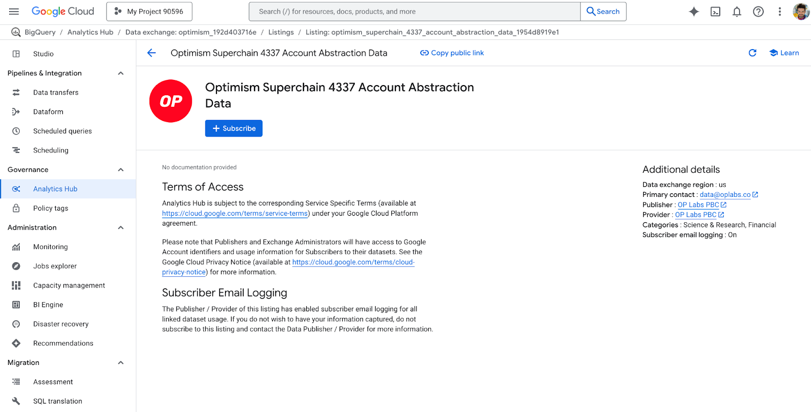
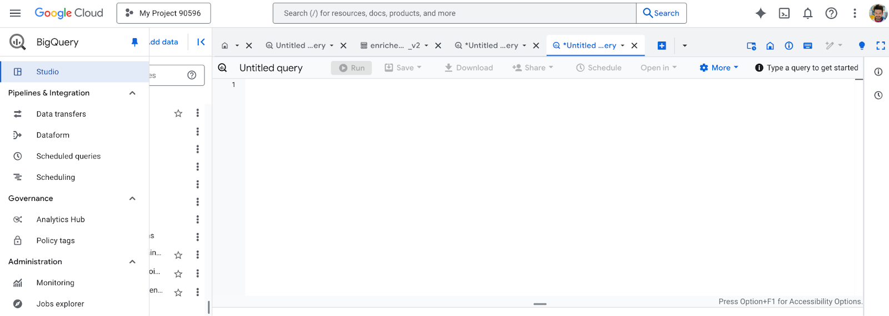
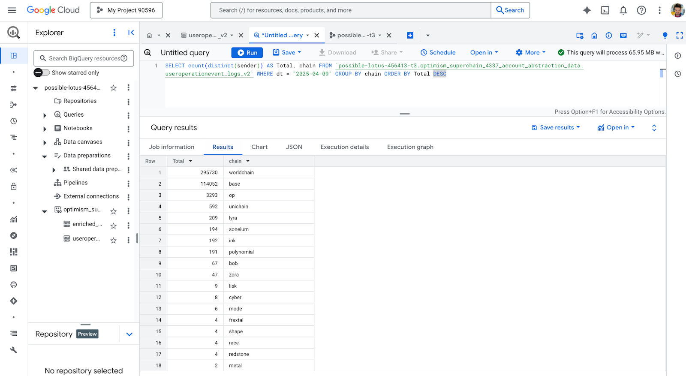
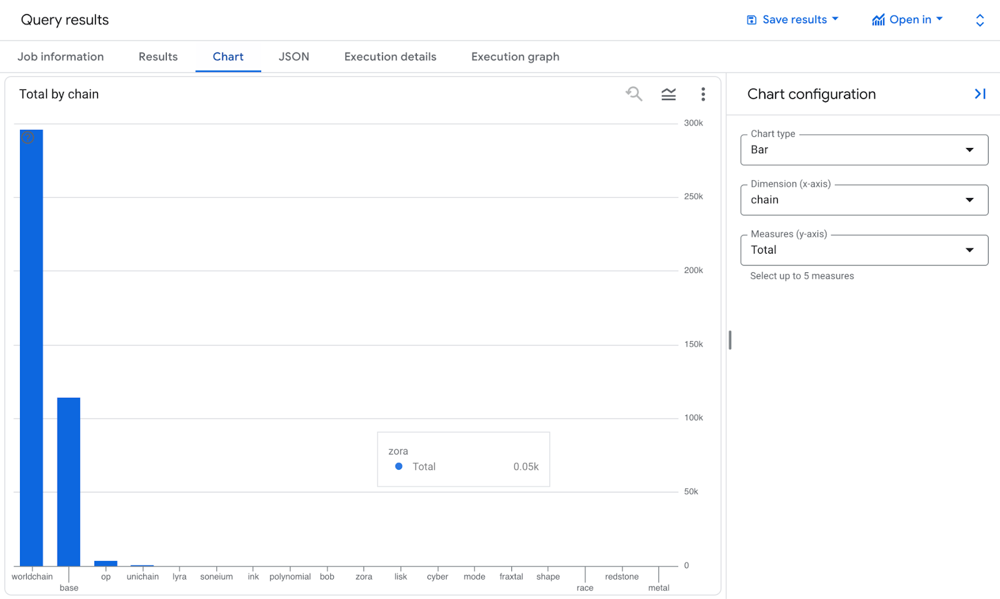
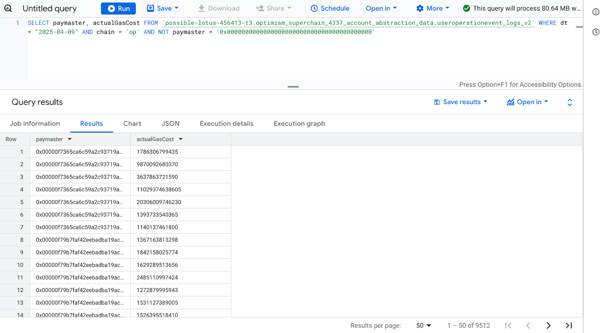
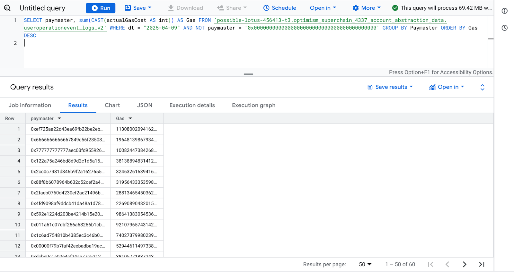
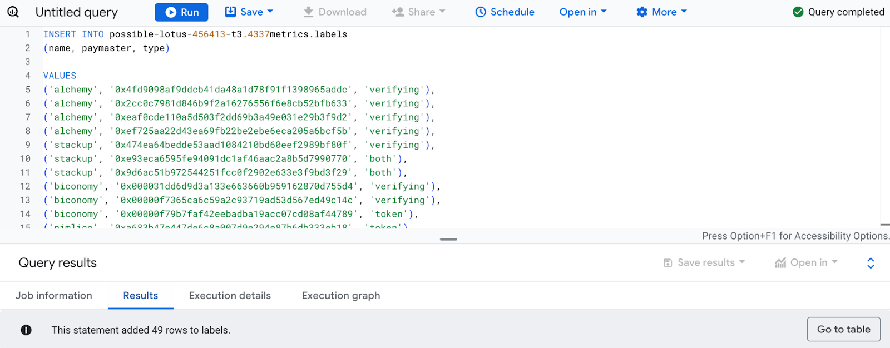
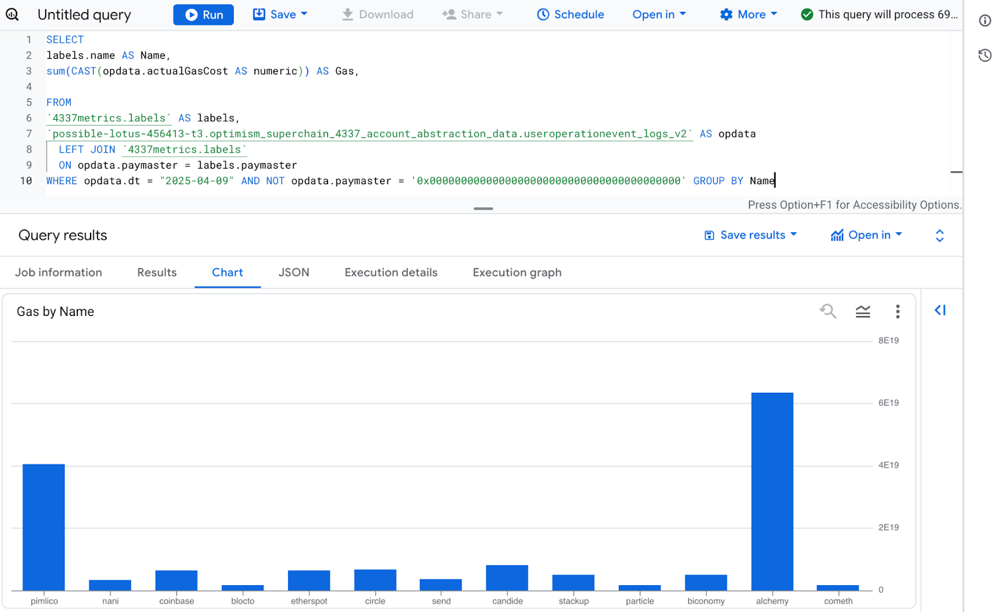

---
title: ow to create your own 4337 metrics?
description: Step-by-step guide on how to use the Optimism Superchain’s public BigQuery datasets to create custom 4337 metrics, analyze Paymaster usage, and enrich insights with BundleBear’s labeled on-chain addresses.
sidebar_position: 4
---

# How to create your own 4337 metrics?

## Using OP Foundation 4337 dataset

In order to utilize the Superchain and 4337 datasets for your own purposes you [need to Subscribe to the Google BigQuery datasets here](https://console.cloud.google.com/bigquery/analytics-hub/exchanges/projects/523274563936/locations/us/dataExchanges/optimism_192d403716e/listings/optimism_superchain_4337_account_abstraction_data_1954d8919e1) and from there you can experiment with the data:

Once subscribed, you’ll be able to access your own workspace with tables linked to the original OP datasets. Then you can move to the “Studio” tab on the left and open a query editor that will give you instant access to the on-chain data. Let’s try to create our first query!

The goal of our query will be to understand how many unique users utilize the Account Abstraction feature on every Superchain network. In order to understand that, we will query 2 columns from the useroperationevent_logs_v2 table:

-   chain (VARCHAR): The official name of the network according to the above list.
-   sender (VARCHAR): Smart contract wallet that sent out the UserOp
    
With simple calculation of the number of unique occurrences of sender variable by using count(distinct(sender)) and grouping these by the chain name, we can easily create a table showing us which network leads in Account Abstraction adoption for a specific day or a period:

    SELECT  count(distinct(sender))  AS  Total, chain  FROM
    
    `[our-database-name].optimism_superchain_4337_account_abstraction_data.useroperationevent_logs_v2`
    
    WHERE  dt = "2025-04-09"  GROUP  BY  chain  ORDER  BY  Total  DESC

You can then save your query, share it or include it into a Notebook or Pipeline which are features specific for Google BigQuery. You can even easily generate a chart out of our data with inbuilt Google Query feature available behind the “Chart” tab:

  
  

## Using OP Foundation 4337 dataset and BundleBear labels

Now let’s try to utilize both datasets described in this article - OP Foundation 4337 dataset available in BigQuery and [4337 labels created by BundleBear available on Github available here.](https://github.com/Jam516/BundleBear/tree/main/models/erc4337/labels)

For the sake of this example, let’s try to find out which Paymaster app is the leading one when it comes to daily gas coverage for smart contract wallets. Starting with a simple query we can easily preview all UserOps that happened with a use of a Paymaster - we just need to exclude all UserOps on Optimism during selected period where the column paymaster is equal to 0x0000000000000000000000000000000000000000 (which basically means that no Paymaster took part in executing the UserOp):

    SELECT  paymaster, actualGasCost  FROM
    
    `[our-dataset-name].optimism_superchain_4337_account_abstraction_data.useroperationevent_logs_v2`
    
    WHERE  dt = "2025-04-09"  AND  chain = 'op'  AND  NOT  paymaster = '0x0000000000000000000000000000000000000000'

We now have a raw list of 9512 UserOps that happened on Optimism on a specific day with the use of Paymaster. Let’s sum the values for specific Paymaster addresses to see who’s the leader:

    SELECT  paymaster, sum(CAST(actualGasCost  AS  int))  AS  Gas  FROM
    
    `[our-dataset-name].optimism_superchain_4337_account_abstraction_data.useroperationevent_logs_v2`
    
    WHERE  dt = "2025-04-09"  AND  NOT  paymaster = '0x0000000000000000000000000000000000000000'  GROUP  BY  Paymaster  ORDER  BY  Gas  DESC

The result is as follows - we can quickly preview that on this specific day there were 60 Paymaster contracts responsible for covering UserOps gas fees:

Now the only thing left to do is to map BundleBear’s Github labels onto the addresses above in order to understand who operates them. The quickest (not the most elegant however) way would be to create an additional table populated with labels:

    CREATE  TABLE  [our-dataset-name].4337metrics.labels  (
    name  STRING,
    paymaster  STRING,
    type  STRING,
    );

Mapping all the columns exactly as in the Github repo allows us to copy paste the whole file and populate the table with labels in seconds:

The only thing left is to create a query that selects paymaster data from both tables (useroperationevent_logs_v2  and  labels), sums the actualGasCost as in our previous example and then combines both tables using LEFT JOIN and grouping by Paymaster name:

    SELECT
    labels.name  AS  Name,
    sum(CAST(opdata.actualGasCost  AS  numeric))  AS  Gas,
    
    FROM
    `4337metrics.labels`  AS  labels,
    `[our-dataset-name].optimism_superchain_4337_account_abstraction_data.useroperationevent_logs_v2`  AS  opdata
    LEFT  JOIN  `4337metrics.labels`
    ON  opdata.paymaster = labels.paymaster
    WHERE  opdata.dt = "2025-04-09"  AND  NOT  opdata.paymaster = '0x0000000000000000000000000000000000000000'  GROUP  BY  Name

The resulting data shows which Paymaster application has the biggest volume of covered gas costs on a specific day. As in the previous example, you can easily generate a chart out of this data:

Thanks for reading and feel free to outreach to Superchain 4337 Team in case any questions or ideas arise!
